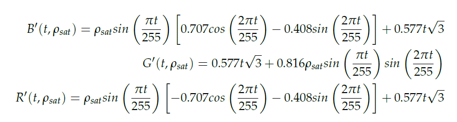
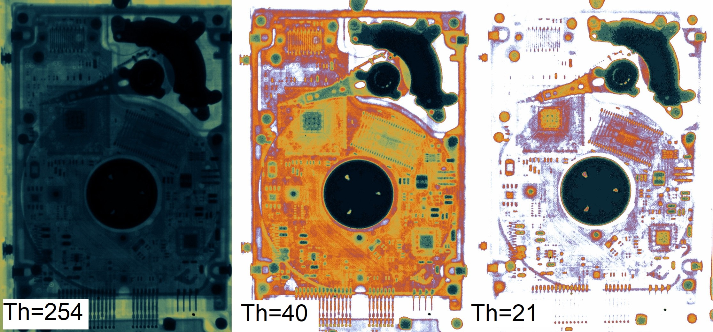

# XFC
Helix Pseudocolor Algorithm C++ by Fran Piernas Diaz

**About XFC**
XFC is a simple implementation of a pseudocolor algorithm I called Helix algorithm. 
It tries to highlight the most opaque parts to X-Rays, attenuating the most 
transparent but without saturating the color of the result.

The equations used are these:

The parameters are:

  t: brighness of a pixel [0,255]
  
  rho_s: color saturation [0,140] (0 gives grayscale values, 140 is the most saturated color and the recommended value)
  
**Example**
Pseudocolor of a Hard Disk Drive radiography using different thresholds.

  
**Requirements**

OpenCV must be installed. To compile, link all OpenCV libraries.

**How to include it to your project**

Place "xfc.hpp" to the same directory as your source code and include it:
#include "xfc.hpp"

**Usage to pseudocolor an image using a single threshold, call this function:**

        Mat xfcs_fframe(Mat sample_i,
                        int saturation,
                        int threshold)

            where:
                sample is the image to color
                saturation is the color saturation from 0 to 140
                threshold is the desired threshold. Low thresholds remove transparent parts

 **Usage to pseudocolor an image with preview of the result, call this function:**

        void fframe_single_threshold(string file,
                                     int saturation)

            where:
                file is the string of the path to the image
                saturation is the color saturation from 0 to 140

            Use the "+" and "-" keys (not those of the numpad) and press enter to select the threshold.

 **Usage to pseudocolor an image with a range of thresholds from 10 to 254, call this function:**

        void threshold_range(string file,
                             int saturation)

        where:
            file is the string of the path to the image
            saturation is the color saturation from 0 to 140
